avant configuration de sécurity 

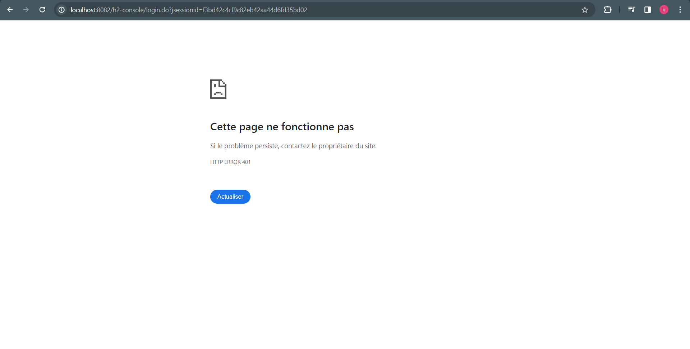
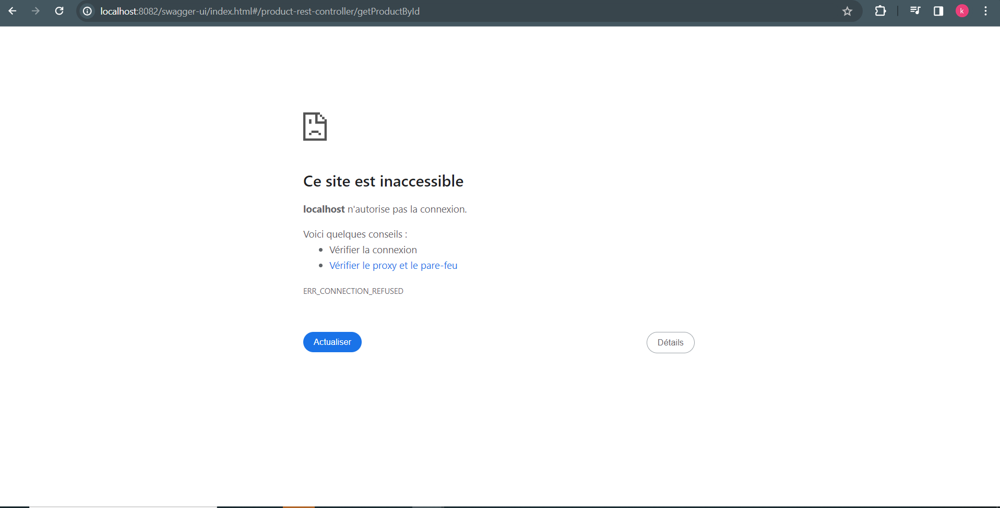

après la configuration
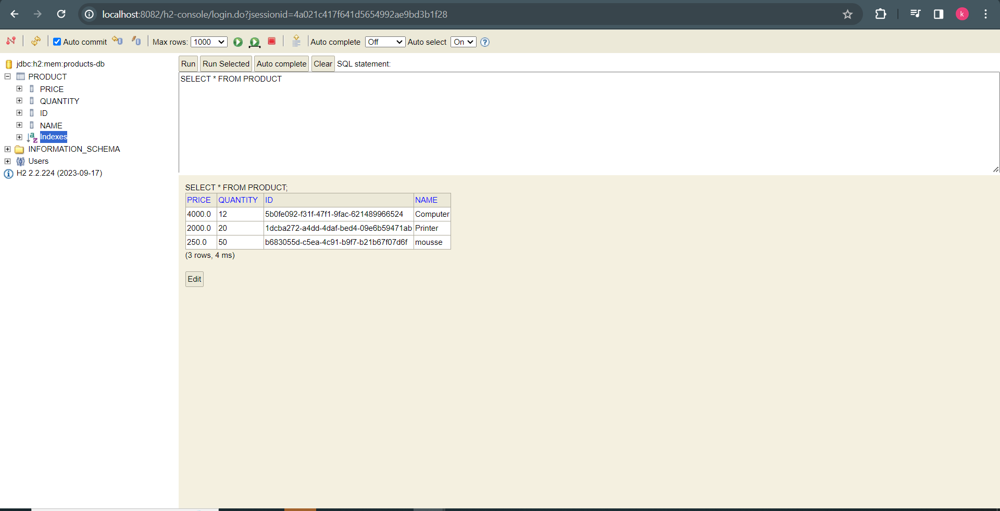
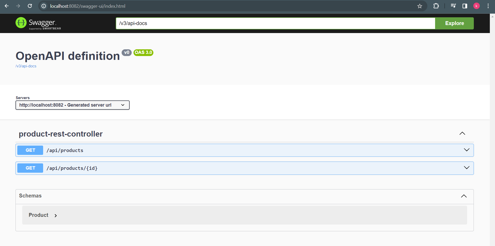
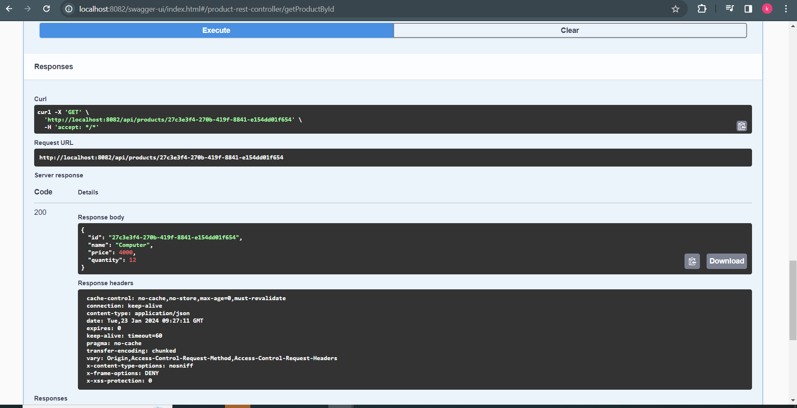
creation de compte Admin keycloak
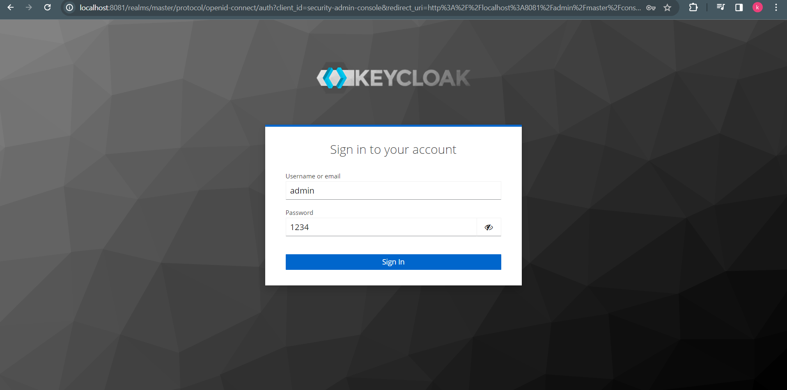
creation une Realm
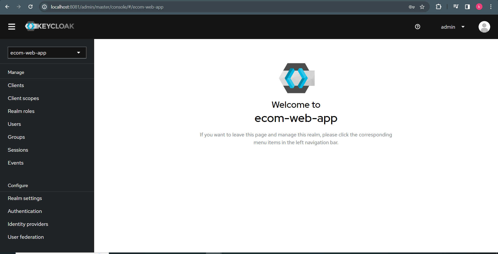
creation des utilisateurs
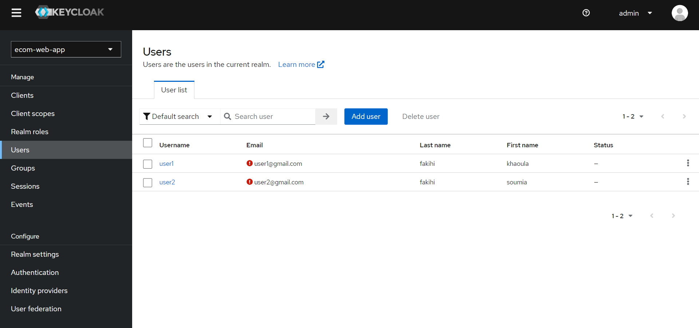
creation des rôles

L'affectation des rôles aux utilisateurs
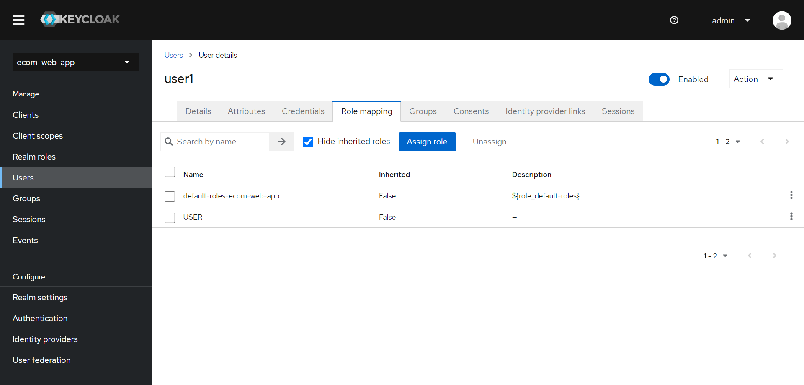
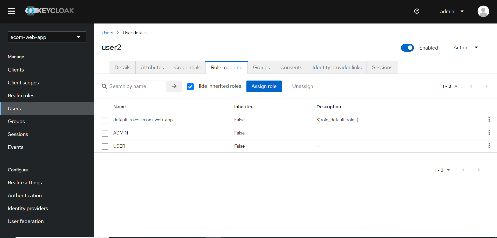

test le microservice backend et frontend
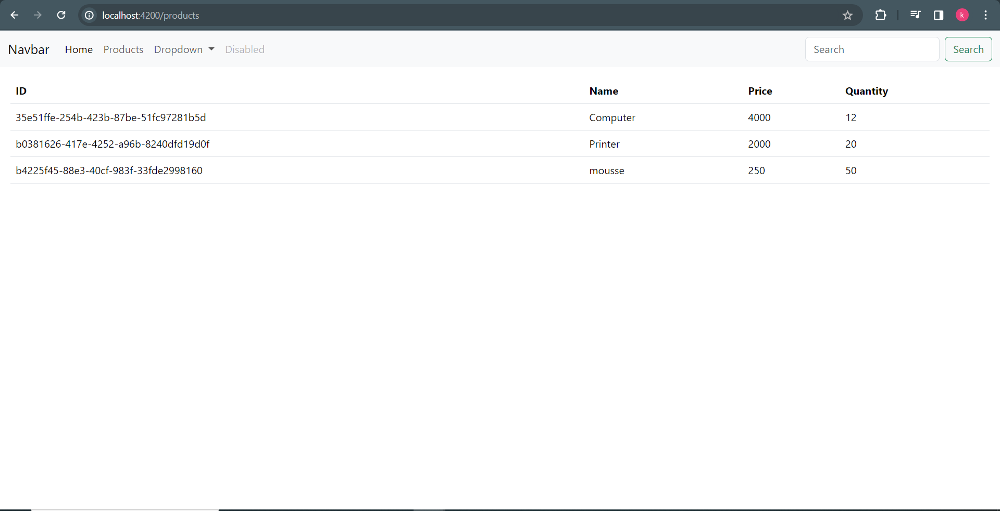
Sécuriser le micro-service Inventory-service
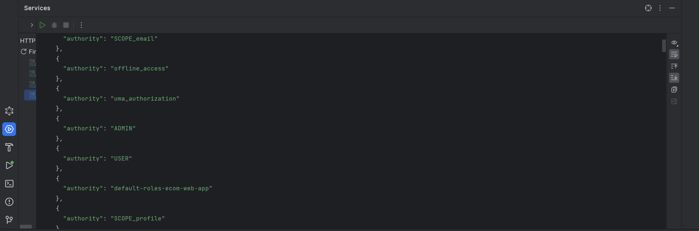

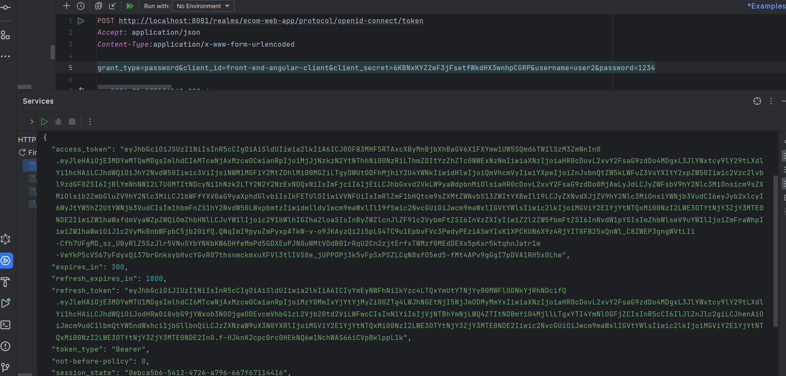
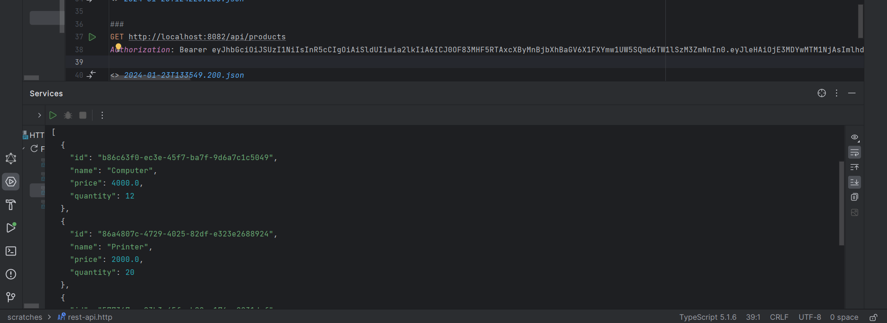
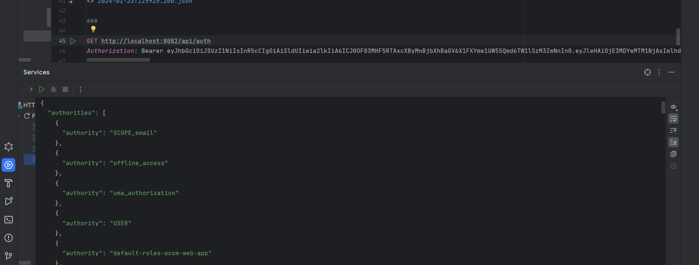
Sécuriser le front end Angular en utilisant un Adaptateur Keycloak