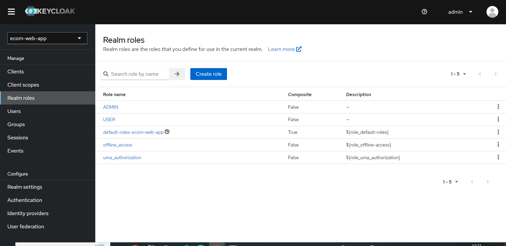
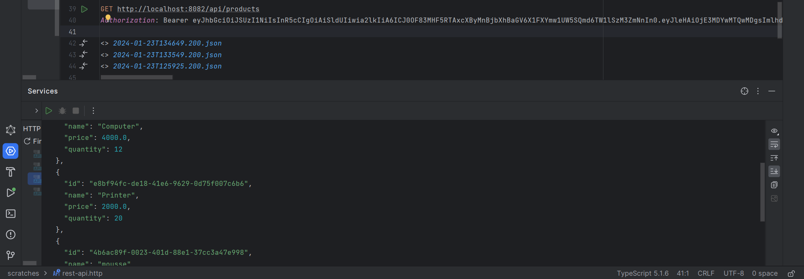

avant configuration de sécurity 

après la configuration

creation de compte Admin keycloak

creation une Realm

creation des utilisateurs

creation des rôles

L'affectation des rôles aux utilisateurs

test le microservice backend et frontend

Sécuriser le micro-service Inventory-service

Sécuriser le front end Angular en utilisant un Adaptateur Keycloak